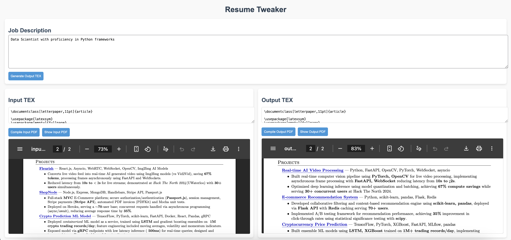

# TaiLOR – AI Resume Tailoring Tool



## Inspiration
2 similar job descriptions but with a few keyword or framework changes, and you have to edit the resume again? Why not use TaiLOR, which tweaks resumes using a bunch of AI models!

## What it does
TaiLOR takes an existing resume and, along with a job description you supply, tweaks the resume to add the technology stack, relevant frameworks, or polish and highlight the desired keywords your resume is missing! With just the press of a button, you get a polished revised resume in PDF format, which you can further edit manually or submit as is. The project provides in-browser integration to view both `.tex` and `.pdf` versions of the resume in real-time, so you can see and edit the changes on the go.

## How I built it
- **Backend:** Node.js with Express.js
- **AI Integration:** OpenAI API and Martian API to route across multiple AI models
- **PDF Compilation:** `pdflatex` for `.tex` to PDF conversion
- **Frontend:** In-browser live editing and viewing of `.tex` and `.pdf` files
- **Design/Prototype:** Warp AI

### Project Architecture
```
TaiLOR/
├─ server.js             # Main Node.js/Express server
├─ texCompiler.js        # Handles .tex -> PDF compilation
├─ agents/
│   └─ martianAgent.js   # Wraps AI model calls for resume tweaks
├─ resume/
│   ├─ input.tex         # Original resume .tex
│   ├─ output.tex        # AI-modified resume .tex
│   └─ desc.txt          # Job description text
├─ pdf/                  # Stores generated PDF files
├─ public/               # Static assets (images, styles if needed)
└─ .env                  # API keys
```

- **Flow:**  
  1. User enters resume `.tex` and job description in-browser.  
  2. Press **Generate Output TEX** → server calls `martianAgent` → updates `output.tex`.  
  3. Compile `.tex` files to PDF with `pdflatex`.  
  4. PDFs served via `/pdf` route for instant browser preview.

- **Tech Stack :**

Tech Stack: Node.js + Express.js backend, OpenAI & Martian API for AI, pdflatex for PDF compilation, HTML/CSS/JS frontend.

## Accomplishments I’m proud of
I solo’ed the project in 14 hours. Successfully integrated multiple AI models for real-time resume improvement. Built an in-browser live editing and PDF preview interface.

## What I learned
First time building an AI agent tool. Learned practical prompt engineering, automation, and dependency management. Hands-on experience connecting backend `.tex` generation with live frontend PDF viewing.

## What’s next for TaiLOR
- Allow sending fragmented sections of resumes to AI models to save time/resources.
- Integrate a web crawler for job search and parsing important keywords.
- Build an automation script for auto-applying to jobs.

## Installation
Clone the repo and install dependencies:
```
git clone https://github.com/username/TaiLOR.git
cd TaiLOR
npm install
```
Create a `.env` file with your API keys:
```
OPENAI_API_KEY=your_openai_key
```
Start the server:
```
node server.js
```
Open `http://localhost:3000` in your browser.

## Usage
1. Enter or paste your resume `.tex` content.
2. Paste the job description.
3. Click **Generate Output TEX** to get AI-tailored resume.
4. Compile and view PDFs with **Compile Input PDF** and **Compile Output PDF** buttons.

## License
MIT License
